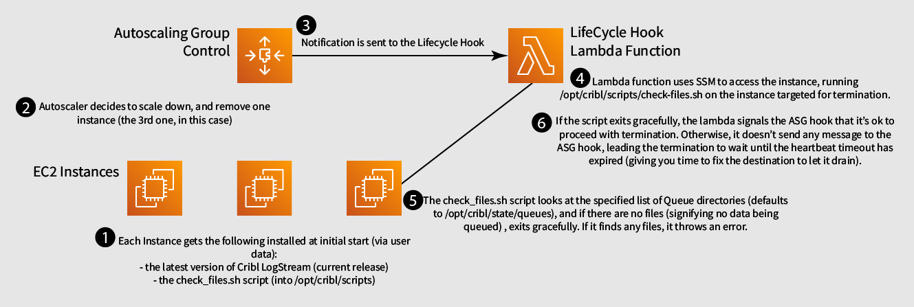

# LogStream Worker Group with Autoscaling Scale Down Hooks 
## Lambda Edition

This solution borrows HEAVILY from the [AWS EC2 Autoscaling Group Examples](https://github.com/aws-samples/amazon-ec2-auto-scaling-group-examples) repo. This repo will deploy a LogStream worker group as an Autoscaling Group, as well as a lambda connected as a lifecycle hook for EC2 Termination requests. 

## Why?

If you're using the persistent queueing feature in LogStream, while using an Autoscaling Group, you have the risk of data loss in a scenario where Autoscaling tries to scale down your ASG while there is backpressure from one or more destinations. Since queueing is done locally to the worker node, if the node is terminated (and the EBS volume destroyed), any data in the queue will be lost. 

## Solution Approach

While there is a plan to have a mechanism for LogStream to drain it's queues before a shutdown, it is not present yet. Additionally, lifecycle hooks in ASG's do not allow you to *cancel* a termination, only delay it. 

### Implementation Diagram 


### Prerequisites

* [AWS CLI](https://docs.aws.amazon.com/cli/latest/userguide/cli-chap-install.html) installed and configured with Administrator credentials.
* [Python 3 installed](https://www.python.org/downloads/)
* [Docker installed](https://www.docker.com/community-edition)
* [SAM CLI installed](https://docs.aws.amazon.com/serverless-application-model/latest/developerguide/serverless-sam-cli-install.html)

## Deployment Steps

Once you've installed all the pre-requisites, and cloned this repo, from the lambda-managed-linux directory, do the following:

1. Create a `S3 bucket` where we can upload our packaged Lambda functions for deployment.

	```bash
	aws s3 mb s3://BUCKET_NAME
	```


1. Build the solution.

	```bash
	sam build --use-container
	```

1. Package the solution. You will need to replace `REPLACE_THIS_WITH_YOUR_S3_BUCKET_NAME` with the name of the S3 bucket created in the first step.

	```bash
	sam package \
	    --output-template-file packaged.yaml \
    	--s3-bucket REPLACE_THIS_WITH_YOUR_S3_BUCKET_NAME
	```

1. Deploy the solution. See the Parameters section for a description of each parameter.
	```bash
	sam deploy \
    	--template-file packaged.yaml \
    	--stack-name lifecycle-hook-example \
    	--capabilities CAPABILITY_IAM \
    	--parameter-overrides \
     	  InstanceKeyPair=REPLACE_THIS_WITH_YOUR_KEY_PAIR_NAME \
     	  InstanceSecurityGroup=REPLACE_THIS_WITH_YOUR_SG \
     	  SubnetIDs=REPLACE_THIS_WITH_A_LIST_OF_SUBNET_IDS \
     	  CriblLeaderHost=REPLACE_THIS_WITH_THE_FQDN_OF_YOUR_CRIBL_LEADER \
     	  CriblLeaderToken=REPLACE_THIS_WITH_DISTRIBUTED_AUTH_TOKEN \
     	  Queues=REPLACE_THIS_WITH_COMMA_DELIMITED_LIST_OF_DIRECTORIES
     	  
	```

## Parameters

|Parameter|Description|Format|Default Value|
|---------|-----------|------|-------------|
|AmiId|AMI to Use for the Autoscaling Group|AMI ID|`/aws/service/ami-amazon-linux-latest/amzn2-ami-hvm-x86_64-gp2`|
|AutoScalingGroupName|Name for the Autoscaling Group|String|Cribl Worker Group Autoscaling Group|
|AutoScalingGroupMinSize|Minimum number of Instances in the Autoscaling Group|Number|1|
|AutoScalingGroupMaxSize|Maximum number of Instances in the Autoscaling Group|Number|4|
|AutoScalingGroupDesiredCapacity|Desired number of instances in the Autoscaling Group (between min and max)|Number|1|
|CriblLeaderHost|Hostname/IP Address for the worker group to use to connect to the leader node.|hostname/FQDN|_none_|
|CriblLeaderPort|TCP Port for the worker group to use to connect to the leader node.|Number|4200|
|CriblLeaderToken|Auth Token for the worker group to use to connect to the leader node.|String|`criblmaster`|
|HeartbeatTimeout|Time (in seconds) to wait before terminating instance|Number|3600|
|InstanceType|Amazon EC2 Instance Type|Instance Type ID|t2.large|
|InstanceKeyPair|Amazon EC2 Key Pair|String|_none_|
|InstanceSecurityGroup|AWS Security Group for the Instances|Security Group ID (sg-<id>)|_none_|
|LifecycleHookName|Name of the Lifecycle Hook Function|String|Cribl-Scaledown-Hook|
|Queues|List of Paths to check for queue data - separated by commas.|Comma Separated List of Directory Paths|`/opt/cribl/stats/queues`
|SubnetIDs|List of Subnet ID's that the instances should spin up in|AWS Subnet IDs (subnet-<id>), comma separated|_none_|
